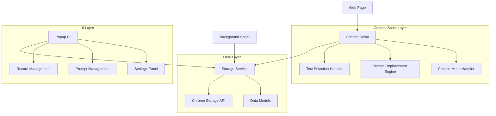

# Design Document

## Overview

这是一个基于 Plasmo 框架的浏览器扩展设计，提供快速记录和智能提示功能。系统采用模块化架构，包含内容脚本、弹出页面、存储管理和用户界面四个主要组件。

## Architecture

### 系统架构图



### 技术栈
- **框架**: Plasmo 0.90.5
- **UI**: React 18.2.0 + TypeScript
- **样式**: Tailwind CSS 3.4.1
- **存储**: Chrome Storage API
- **权限**: host_permissions for all URLs

## Components and Interfaces

### 1. Content Script Components

#### TextSelectionHandler
负责处理网页文本选择和快速记录功能。

```typescript
interface TextSelectionHandler {
  detectTextSelection(): boolean
  showContextMenu(position: Position): void
  saveSelectedText(text: string, category: RecordCategory): Promise<void>
  showSuccessNotification(): void
}
```

#### PromptReplacementEngine
处理输入框中的 prompt 替换逻辑。

```typescript
interface PromptReplacementEngine {
  detectTriggerPattern(inputText: string): boolean
  extractPromptKey(triggerText: string): string
  replaceWithPrompt(element: HTMLElement, key: string): Promise<void>
  attachInputListeners(): void
}
```

### 2. Popup UI Components

#### RecordManager
记录管理界面组件。

```typescript
interface RecordManagerProps {
  records: Record[]
  selectedCategory: RecordCategory
  searchQuery: string
  onCategoryChange: (category: RecordCategory) => void
  onSearch: (query: string) => void
  onEdit: (record: Record) => void
  onDelete: (recordId: string) => void
}
```

#### PromptManager
Prompt 模板管理界面组件。

```typescript
interface PromptManagerProps {
  prompts: Prompt[]
  onAdd: (prompt: Prompt) => void
  onEdit: (prompt: Prompt) => void
  onDelete: (promptId: string) => void
  onValidateKey: (key: string) => boolean
}
```

### 3. Storage Service

#### StorageService
统一的数据存储服务。

```typescript
interface StorageService {
  // Record operations
  saveRecord(record: Record): Promise<void>
  getRecordsByCategory(category: RecordCategory): Promise<Record[]>
  getAllRecords(): Promise<Record[]>
  updateRecord(record: Record): Promise<void>
  deleteRecord(recordId: string): Promise<void>
  
  // Prompt operations
  savePrompt(prompt: Prompt): Promise<void>
  getAllPrompts(): Promise<Prompt[]>
  getPromptByKey(key: string): Promise<Prompt | null>
  updatePrompt(prompt: Prompt): Promise<void>
  deletePrompt(promptId: string): Promise<void>
}
```

## Data Models

### Record Model
```typescript
interface Record {
  id: string
  content: string
  category: RecordCategory
  sourceUrl: string
  sourceTitle: string
  createdAt: Date
  updatedAt: Date
}

type RecordCategory = '灵感' | '待办' | '信条' | '其他'
```

### Prompt Model
```typescript
interface Prompt {
  id: string
  key: string
  title: string
  content: string
  description?: string
  createdAt: Date
  updatedAt: Date
}
```

### Storage Schema
```typescript
interface StorageSchema {
  records: Record[]
  prompts: Prompt[]
  settings: {
    defaultCategory: RecordCategory
    enableNotifications: boolean
    shortcutKeys: ShortcutConfig
  }
}
```

## Error Handling

### 错误类型定义
```typescript
enum ErrorType {
  STORAGE_ERROR = 'STORAGE_ERROR',
  VALIDATION_ERROR = 'VALIDATION_ERROR',
  PERMISSION_ERROR = 'PERMISSION_ERROR',
  NETWORK_ERROR = 'NETWORK_ERROR'
}

interface AppError {
  type: ErrorType
  message: string
  details?: any
}
```

### 错误处理策略
1. **存储错误**: 显示用户友好的错误消息，提供重试选项
2. **验证错误**: 实时表单验证，高亮错误字段
3. **权限错误**: 引导用户检查扩展权限设置
4. **网络错误**: 离线模式支持，数据本地缓存


## Performance Considerations

### 优化策略
1. **防抖**: 搜索输入和 prompt 检测的防抖处理

### 内存管理
- 及时清理事件监听器
- 限制内存中缓存的数据量
- 定期清理过期的临时数据

## Security Considerations

### 数据安全
- 敏感数据加密存储
- 输入内容的 XSS 防护
- CSP (Content Security Policy) 配置

### 权限最小化
- 仅请求必要的 host_permissions
- 限制 content script 的执行范围
- 用户数据的本地存储，避免网络传输